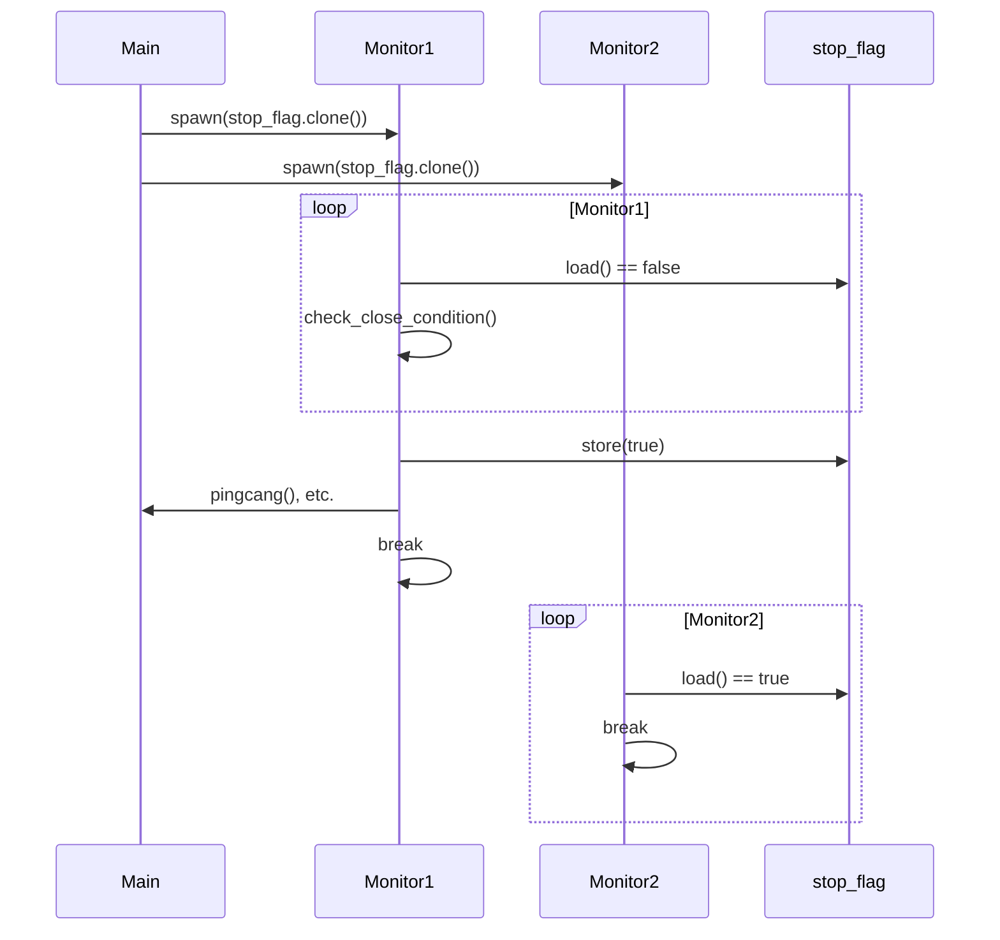
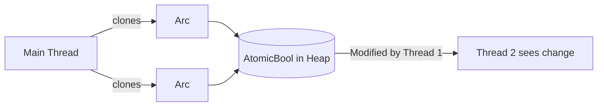

你完全正确：当前的问题本质是**多个独立线程分别实现了 `PositionMonitor` trait 实例（如 TrendStopMonitor / RetracementMonitor）**，它们**没有共享状态**，即使一个监控线程满足了平仓条件并执行了 `pingcang`，**其他线程并不知道，仍然继续运行**。

---

## ✅ 解决方向：加入统一的**线程共享开关（flag）**

你可以通过一个 `Arc<AtomicBool>` 或 `Arc<AtomicU8>` 作为**线程间共享状态**，在任一线程检测到平仓成功后，设置该开关，其他线程检查这个开关并自动退出。

---

## ✅ 实现方案：加入共享终止信号（`stop_flag`）

### 1. 定义统一的 trait 带 `stop_flag`

修改你的 `PositionMonitor` trait：

```rust
use std::sync::Arc;
use std::sync::atomic::{AtomicBool, Ordering};

pub trait PositionMonitor: Send {
    fn check_close_condition(&self) -> Result<bool, BinanceError>;
    fn key_group(&self) -> u32;

    fn run_monitor_loop(&self, stop_flag: Arc<AtomicBool>) -> Result<(), BinanceError> {
        loop {
            // 检查是否被其他线程关闭
            if stop_flag.load(Ordering::Relaxed) {
                break;
            }

            if self.check_close_condition()? {
                crate::modules::pingcang::pingcang(None, None, Some(self.key_group()), None)?;
                crate::utils::redis::RedisUtil::del_hash_field(
                    &format!("Analysis_Price{}", self.key_group()),
                    "max_profit",
                )?;

                // 设置终止信号，其他线程会自动退出
                stop_flag.store(true, Ordering::Relaxed);
                break;
            }

            std::thread::sleep(std::time::Duration::from_secs(3));
        }
        Ok(())
    }
}
```

---

### 2. 各个 monitor struct 保持不变，但 run\_monitor\_loop 接收 `stop_flag`

---

### 3. 在启动线程处共享这个标志

修改你的 `start_all_position_monitors`：

```rust
use std::sync::{Arc, atomic::{AtomicBool, Ordering}};

pub fn start_all_position_monitors(key_group: u32) {
    let result = get_position_info(None, None, Some(key_group));

    match result {
        Ok(position) => {
            if position.position_amt == "0.000" || position.side.is_empty() {
                info!("key_group {} 当前为空仓，跳过监控启动", key_group);
                return;
            }
            info!("📡 启动价格trait回撤监控线程（组号 {}）", key_group);

            let entry_price = position.entry_price.parse().unwrap_or(0.0);
            let stop_flag = Arc::new(AtomicBool::new(false)); // 👈 新增共享标志

            let monitors: Vec<Box<dyn PositionMonitor>> = vec![
                Box::new(TrendStopMonitor {
                    key_group,
                    side: position.side.clone(),
                }),
                Box::new(RetracementMonitor {
                    key_group,
                    side: position.side.clone(),
                    entry_price,
                }),
            ];

            for monitor in monitors {
                let stop_flag = stop_flag.clone();
                std::thread::spawn(move || {
                    if let Err(e) = monitor.run_monitor_loop(stop_flag) {
                        info!("监控错误: {:?}", e);
                    }
                });
            }
        }
        Err(e) => {
            info!("获取持仓失败，key_group {}: {:?}", key_group, e);
        }
    }
}
```

---

## ✅ 效果说明

* 任意一个 monitor 满足条件后执行 `pingcang` 并设置 `stop_flag = true`；
* 所有其他线程在下一轮循环中读取 `stop_flag`，自动退出；
* 不再重复执行 `pingcang`；
* 不再需要依赖 Redis 键删除作为是否已平仓的判断。

---

## ✅ Bonus：避免多次 `pingcang` 的保险措施

虽然加了 `stop_flag` 已基本避免重复 pingcang，但你还可以在 `pingcang()` 内部做一次锁判断或状态确认，例如：

```rust
pub fn pingcang(...) -> Result<bool, BinanceError> {
    // 检查当前是否有持仓，没有直接返回 Ok(false)
    if !has_position(...) { return Ok(false); }

    // 执行下单逻辑
    ...
}
```

---

如果你希望我帮你改 Trait 定义或具体监控器代码，我也可以进一步提供模板。是否需要我把完整 Trait + 启动模板都打包成一个你可以直接用的版本？

You are absolutely right: the essence of the current problem is that **multiple independent threads implement `PositionMonitor` trait instances (such as TrendStopMonitor / RetracementMonitor)**, and they **have no shared state**. Even if a monitoring thread meets the closing condition and executes `pingcang`, **other threads do not know and continue to run**.

---

## ✅ Solution direction: Add a unified **thread sharing switch (flag)**

You can use an `Arc<AtomicBool>` or `Arc<AtomicU8>` as **inter-thread shared state**. After any thread detects that the closing is successful, set the switch, and other threads check this switch and automatically exit.

---

## ✅ Implementation: Add a shared termination signal (`stop_flag`)

### 1. Define a unified trait with `stop_flag`

Modify your `PositionMonitor` trait:

```rust
use std::sync::Arc;
use std::sync::atomic::{AtomicBool, Ordering};

pub trait PositionMonitor: Send {
fn check_close_condition(&self) -> Result<bool, BinanceError>;
fn key_group(&self) -> u32;

fn run_monitor_loop(&self, stop_flag: Arc<AtomicBool>) -> Result<(), BinanceError> {
loop {
// Check if it is closed by other threads
if stop_flag.load(Ordering::Relaxed) {
break;
}

if self.check_close_condition()? {
crate::modules::pingcang::pingcang(None, None, Some(self.key_group()), None)?;
crate::utils::redis::RedisUtil::del_hash_field(
&format!("Analysis_Price{}", self.key_group()),
"max_profit",
)?;

// Set the termination signal, other threads will automatically exit
stop_flag.store(true, Ordering::Relaxed);
break;
}

std::thread::sleep(std::time::Duration::from_secs(3));
}
Ok(())
}
}
```

---

### 2. Each monitor struct remains unchanged, but run\_monitor\_loop receives `stop_flag`

---

### 3. Share this flag at the start thread

Modify your `start_all_position_monitors`:

```rust
use std::sync::{Arc, atomic::{AtomicBool, Ordering}};

pub fn start_all_position_monitors(key_group: u32) {
let result = get_position_info(None, None, Some(key_group));

match result {
Ok(position) => {
if position.position_amt == "0.000" || position.side.is_empty() {
info!("key_group {} is currently empty, skip monitoring start", key_group);
return;
}
info!("📡 Start price trait retracement monitoring thread (group number {})", key_group);

let entry_price = position.entry_price.parse().unwrap_or(0.0);
let stop_flag = Arc::new(AtomicBool::new(false)); // 👈 Add a shared flag

let monitors: Vec<Box<dyn PositionMonitor>> = vec![
Box::new(TrendStopMonitor {
key_group,
side: position.side.clone(),
}),
Box::new(RetracementMonitor {
key_group,
side: position.side.clone(),
entry_price,
}),
];

for monitor in monitors {
let stop_flag = stop_flag.clone();
std::thread::spawn(move || {
if let Err(e) = monitor.run_monitor_loop(stop_flag) {
info!("Monitor error: {:?}", e);
}
});
}
}
Err(e) => {
info!("Failed to get position, key_group {}: {:?}", key_group, e);
}
}
}
```

---

## ✅ Effect description

* After any monitor meets the conditions, execute `pingcang` and set `stop_flag = true`;

* All other threads read `stop_flag` in the next cycle and exit automatically;

* No longer execute `pingcang` repeatedly;

* No longer need to rely on Redis key deletion as a judgment of whether the position has been closed.

---

## ✅ Bonus: Insurance measures to avoid multiple `pingcang`

Although adding `stop_flag` has basically avoided repeated pingcang, you can still do a lock judgment or status confirmation inside `pingcang()`, for example:

```rust
pub fn pingcang(...) -> Result<bool, BinanceError> {
// Check if there is a current position, if not, return Ok(false) directly
if !has_position(...) { return Ok(false); }

// Execute order logic
...
}
```

---

If you want me to help you modify the Trait definition or specific monitor code, I can also provide a template. Do you need me to package the complete Trait + startup template into a version that you can use directly?
  
The shared `stop_flag` (an `Arc<AtomicBool>`) coordinates thread termination across multiple monitors in your Rust code. Here's how it works:

---

### **1. Flag Initialization**
```rust
let stop_flag = Arc::new(AtomicBool::new(false));  // Initialized to `false`
```
- Created once in `start_all_position_monitors` and shared across all monitor threads via `Arc` (atomic reference counting).

---

### **2. Thread Coordination Flow**

#### **Monitoring Threads (run_monitor_loop)**
Each spawned thread:
1. **Checks the flag periodically**:
   ```rust
   if stop_flag.load(Ordering::Relaxed) { break; }
   ```
   - Uses `Relaxed` ordering (no synchronization guarantees beyond atomicity).
   - If `true`, the thread exits its loop.

2. **Sets the flag on close condition**:
   ```rust
   stop_flag.store(true, Ordering::Relaxed);
   ```
   - When any monitor detects a close condition (e.g., `check_close_condition()` returns `true`), it:
     1. Triggers the closing logic (`pingcang()`, Redis cleanup).
     2. Atomically sets `stop_flag` to `true`.
     3. Breaks its own loop.

#### **All Other Threads**
- **See the flag change** on their next iteration (after `sleep(3)`).
- **Exit gracefully** without executing redundant close operations.

---

### **3. Memory Ordering (`Ordering::Relaxed`)**
- **Why `Relaxed` works here**:
  - The flag is a **single atomic variable** with no dependent operations.
  - Threads don't need to see updates immediately (3-second sleep provides natural synchronization).
  - No other shared data depends on the flag's state.

- **When to use stricter ordering**:
  - If other non-atomic data must be synchronized with the flag, use `Ordering::Release` (on store) and `Ordering::Acquire` (on load).

---

### **4. Key Behaviors**

| Scenario | Outcome |
|----------|---------|
| **Normal operation** | All threads run until one detects a close condition. |
| **Flag set to `true`** | All threads exit within 3 seconds (next sleep wakeup). |
| **Thread panic** | `AtomicBool` is immune to poisoning (unlike `Mutex`). |
| **Multiple close conditions** | Only the first trigger executes `pingcang()` (others see `stop_flag == true`). |
{:.markdown-table}
---

### **5. Lifecycle Example**





---

### **6. Why This Works**
- **AtomicBool**: Ensures safe cross-thread updates without locks.
- **Arc**: Allows shared ownership across threads.
- **Sleep-based polling**: Adequate for this use case (no tight loops).

For stricter synchronization (e.g., immediate termination), consider:
```rust
stop_flag.store(true, Ordering::Release);  // In setter
if stop_flag.load(Ordering::Acquire) { ... }  // In checker
```
But your current implementation is correct for the described workflow.


### problem  

Since the shared variable is passed through parameters, why is the previous code also affected when the value of the parameter is modified?

  
In your Rust code, the shared `stop_flag` (an `Arc<AtomicBool>`) propagates changes across all threads because of how **shared ownership** and **atomic operations** work. Here's why modifying it in one thread affects others:

---

### **1. `Arc<T>` Enables Shared Ownership**
- When you clone the `Arc`:
  ```rust
  let stop_flag = Arc::new(AtomicBool::new(false));
  let stop_flag_clone = stop_flag.clone();  // New Arc pointing to the same AtomicBool
  ```
  - Each `Arc` incrementally tracks references to the **same heap-allocated `AtomicBool`**.
  - Cloning an `Arc` doesn’t copy the `AtomicBool`; it creates a new pointer to the original.

### **2. `AtomicBool` Provides Thread-Safe Mutations**
- The `AtomicBool` inside the `Arc` guarantees:
  - **Atomic reads/writes**: No partial updates or data races.
  - **Visibility**: Changes are eventually seen by all threads (even with `Ordering::Relaxed` in your case).

### **3. Why Modifications Propagate**
When any thread executes:
```rust
stop_flag.store(true, Ordering::Relaxed);
```
1. The `AtomicBool`’s value is updated in memory.
2. Other threads observe this change on their **next `load()`**:
   ```rust
   if stop_flag.load(Ordering::Relaxed) { break; }
   ```
   - Even with `Relaxed` ordering, the change will propagate (though timing isn’t instant).

---

### **4. Key Insights**
| Mechanism | Role |
|-----------|------|
| **`Arc`** | Ensures the `AtomicBool` lives as long as any thread uses it. |
| **`AtomicBool`** | Enables safe mutation across threads without locks. |
| **Parameter Passing** | Each thread gets its own `Arc` clone, all pointing to the same `AtomicBool`. |

---

### **5. Practical Implications**
- **No Race Conditions**: Only one thread can trigger `pingcang()` because:
  1. The first thread to detect a close condition sets `stop_flag = true`.
  2. Other threads see this and exit.
- **No Copies**: The `AtomicBool` is never copied; all `Arc`s point to the same memory location.

---

### **6. Visualization**


---

### **7. Why This is Safe**
- **Thread-Safety**: `Arc` handles reference counting atomically; `AtomicBool` handles value changes atomically.
- **Deterministic Exit**: All threads exit once any thread sets the flag, avoiding redundant work.

For immediate visibility of the flag change, consider stricter memory ordering (e.g., `Ordering::Release`/`Acquire`), but your current use case (with `sleep(3)`) works fine with `Relaxed`.