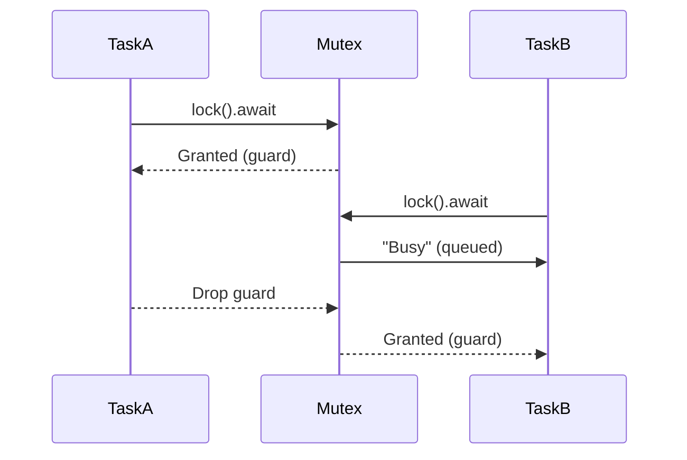

明白了，让我们通过代入具体的数字来一步步解释这个程序的执行过程，并预测每个步骤的结果。假设我们有3个线程而不是10个，以便简化示例分析。

### 修改后的代码（仅用于说明）

```rust
use std::sync::{Arc, Mutex};
use std::thread;

fn main() {
    // 使用 Arc 和 Mutex 包装一个 i32 类型的计数器。
    let counter = Arc::new(Mutex::new(0));
    let mut handles = vec![];

    for _ in 0..3 { // 减少线程数量到3个以简化分析
        let counter_clone = Arc::clone(&counter);
        let handle = thread::spawn(move || {
            let mut num = counter_clone.lock().unwrap();
            *num += 1;
            println!("Counter updated to {}", *num);
        });
        handles.push(handle);
    }

    for handle in handles {
        handle.join().unwrap();
    }

    println!("Final counter value: {}", *counter.lock().unwrap());
}
```

### 步骤解析

#### 初始状态
- `counter` 的初始值为 `0`。

#### 线程启动和操作

由于线程的执行顺序是不确定的，我们将考虑一种可能的执行顺序来进行分析。注意实际运行时可能会有所不同，但结果应该是相同的。

1. **第一个线程**
   - 获取 `counter` 的锁并将其值从 `0` 增加到 `1`。
   - 打印 `"Counter updated to 1"`。

2. **第二个线程**
   - 获取 `counter` 的锁并等待第一个线程释放锁（如果第一个线程还没有完成）。
   - 将其值从 `1` 增加到 `2`。
   - 打印 `"Counter updated to 2"`。

3. **第三个线程**
   - 获取 `counter` 的锁并等待前两个线程释放锁（如果它们还没有完成）。
   - 将其值从 `2` 增加到 `3`。
   - 打印 `"Counter updated to 3"`。

#### 最终状态
- 主线程等待所有子线程完成后，获取 `counter` 的最终值并打印出来：`"Final counter value: 3"`。

### 可能的输出示例

根据上述步骤，一个可能的输出结果如下：

```
Counter updated to 1
Counter updated to 2
Counter updated to 3
Final counter value: 3
```

请注意，因为线程调度是由操作系统管理的，所以实际的输出顺序可能会有所不同。例如，有时你可能会看到：

```
Counter updated to 1
Counter updated to 3
Counter updated to 2
Final counter value: 3
```

但是最终的计数值始终会是 `3`，因为每个线程都会对计数器进行一次递增操作。这就是使用 `Mutex` 来确保在多线程环境中安全地访问共享资源的重要性。它保证了每次只有一个线程可以修改数据，从而避免了竞争条件的发生。  

Got it, let's explain the execution of this program step by step by plugging in specific numbers and predict the results of each step. Assume that we have 3 threads instead of 10 to simplify the example analysis.

### Modified code (for illustration only)

```rust
use std::sync::{Arc, Mutex};
use std::thread;

fn main() {
// Use Arc and Mutex to wrap an i32 type counter.
let counter = Arc::new(Mutex::new(0));
let mut handles = vec![];

for _ in 0..3 { // Reduce the number of threads to 3 to simplify analysis
let counter_clone = Arc::clone(&counter);
let handle = thread::spawn(move || {
let mut num = counter_clone.lock().unwrap();
*num += 1;
println!("Counter updated to {}", *num);
});
handles.push(handle);
}

for handle in handles {
handle.join().unwrap();
}

println!("Final counter value: {}", *counter.lock().unwrap());
}
```

### Step analysis

#### Initial state
- The initial value of `counter` is `0`.

#### Thread startup and operation

Since the execution order of threads is undefined, we will consider one possible execution order for analysis. Note that the actual runtime may be different, but the result should be the same.

1. **First thread**
- Acquires the lock of `counter` and increments its value from `0` to `1`.
- Prints `"Counter updated to 1"`.

2. **Second thread**
- Acquires the lock of `counter` and waits for the first thread to release the lock (if the first thread has not yet completed).
- Increments its value from `1` to `2`.
- Prints `"Counter updated to 2"`.

3. **Third thread**
- Acquires the lock of `counter` and waits for the first two threads to release the lock (if they have not yet completed).
- Increments its value from `2` to `3`.
- Prints `"Counter updated to 3"`.

#### Final state
- After the main thread waits for all child threads to complete, it gets the final value of `counter` and prints it out: `"Final counter value: 3"`.

### Possible output example

Based on the above steps, a possible output result is as follows:

```
Counter updated to 1
Counter updated to 2
Counter updated to 3
Final counter value: 3
```

Note that because thread scheduling is managed by the operating system, the actual output order may be different. For example, sometimes you may see:

```
Counter updated to 1
Counter updated to 3
Counter updated to 2
Final counter value: 3
```

But the final counter value will always be `3` because each thread increments the counter once. This is why it is important to use `Mutex` to ensure safe access to shared resources in a multi-threaded environment. It ensures that only one thread can modify the data at a time, thus avoiding race conditions.  
The issue is that the `levels` vector in the `main` function isn't being updated properly for the `monitor_price` function to use the new data. This happens because Rust's ownership rules prevent sharing mutable references across async boundaries.

Here's how to fix it:

1. First, modify the `main.rs` to use an `Arc<Mutex<Vec<SupportResistanceLevel>>>` to share the levels between tasks:

```rust
// src/main.rs
use std::sync::Arc;
use tokio::sync::Mutex;

// ... existing imports ...

#[tokio::main]
async fn main() -> Result<()> {
    println!("🚀 Starting BTCUSDT Support/Resistance Monitor");

    let mut client = BinanceClient::new().await?;
    let analyzer = TechnicalAnalyzer::new();
    let mut monitor = PriceMonitor::new();

    // Store support/resistance levels in a thread-safe shared structure
    let levels = Arc::new(Mutex::new(Vec::new()));

    // Timing variables
    let mut last_analysis_time = Instant::now();
    let analysis_interval = Duration::from_secs(4 * 60 * 60); // 4 hours
    let monitor_interval = Duration::from_secs(3); // 3 seconds

    // Initial level calculation
    println!("🔄 Calculating initial support/resistance levels...");
    match update_levels(&mut client, &analyzer, &levels).await {
        Ok(_) => println!("✅ Initial levels calculated successfully"),
        Err(e) => {
            eprintln!("❌ Failed initial level calculation: {}", e);
            return Err(e);
        }
    }

    println!("📊 Monitoring started - Press Ctrl+C to stop");

    let mut monitor_timer = interval(monitor_interval);

    loop {
        tokio::select! {
            // Monitor price every 3 seconds
            _ = monitor_timer.tick() => {
                if let Err(e) = monitor_price(&mut client, &mut monitor, &levels).await {
                    eprintln!("⚠️  Price monitoring error: {}", e);
                }

                // Check if it's time to update levels (every 4 hours)
                if last_analysis_time.elapsed() >= analysis_interval {
                    match update_levels(&mut client, &analyzer, &levels).await {
                        Ok(_) => {
                            println!("✅ Support/Resistance levels updated");
                            last_analysis_time = Instant::now();
                        },
                        Err(e) => eprintln!("❌ Failed to update levels: {}", e),
                    }
                }
            }

            // Handle Ctrl+C
            _ = tokio::signal::ctrl_c() => {
                println!("\n🛑 Shutting down monitor...");
                break;
            }
        }
    }

    Ok(())
}

async fn update_levels(
    client: &mut BinanceClient,
    analyzer: &TechnicalAnalyzer,
    levels: &Arc<Mutex<Vec<SupportResistanceLevel>>>,
) -> Result<()> {
    println!("🔄 Updating support/resistance levels...");

    // Get historical data from Binance API
    let klines = client.get_klines("BTCUSDT", "4h", 500).await?;
    // Get current price from Redis
    let current_price = client.get_current_price_from_redis().await?;

    // Calculate new levels
    let new_levels = analyzer.calculate_levels(&klines, current_price).await?;

    // Update levels
    {
        let mut levels_lock = levels.lock().await;
        *levels_lock = new_levels;
    }

    // Display analysis
    analyzer.display_analysis(&new_levels, current_price).await;

    Ok(())
}

async fn monitor_price(
    client: &mut BinanceClient,
    monitor: &mut PriceMonitor,
    levels: &Arc<Mutex<Vec<SupportResistanceLevel>>>,
) -> Result<()> {
    let current_price = client.get_current_price_from_redis().await?;

    let levels_lock = levels.lock().await;
    if !levels_lock.is_empty() {
        monitor.check_proximity(current_price, &levels_lock).await?;
    }

    Ok(())
}
```

2. Update the `PriceMonitor` implementation to accept the reference to levels:

```rust
// src/price_monitor.rs
use std::sync::Arc;
use tokio::sync::Mutex;

// ... existing code ...

impl PriceMonitor {
    // ... existing methods ...

    pub async fn check_proximity(
        &self,
        current_price: f64,
        levels: &[SupportResistanceLevel],  // This stays the same
    ) -> Result<()> {
        // ... existing implementation ...
    }
}
```

3. Add the required dependency to `Cargo.toml`:

```toml
[dependencies]
tokio = { version = "1.0", features = ["full", "sync"] }
```

The key changes are:

1. Using `Arc<Mutex<Vec<SupportResistanceLevel>>>` to share the levels between tasks
2. Properly locking the mutex when accessing or updating the levels
3. Passing the shared reference to both `update_levels` and `monitor_price` functions

This solution ensures that:
- The levels data can be safely shared between the monitoring and updating tasks
- The price monitoring will always use the most recent levels data
- There are no data races or ownership issues
- The updates happen atomically

The `Mutex` ensures that only one task can modify the levels at a time, while the `Arc` allows multiple tasks to hold references to the same data. The `lock().await` pattern ensures proper async locking behavior.  

The error occurs because we're trying to use `new_levels` after moving it into the `levels` Mutex. Here's how to fix this:

1. First, let's modify the `update_levels` function to clone the levels before displaying them:

```rust
async fn update_levels(
    client: &mut BinanceClient,
    analyzer: &TechnicalAnalyzer,
    levels: &Arc<Mutex<Vec<SupportResistanceLevel>>>,
) -> Result<()> {
    println!("🔄 Updating support/resistance levels...");

    // Get historical data from Binance API
    let klines = client.get_klines("BTCUSDT", "4h", 500).await?;
    // Get current price from Redis
    let current_price = client.get_current_price_from_redis().await?;

    // Calculate new levels
    let new_levels = analyzer.calculate_levels(&klines, current_price).await?;

    // Clone the levels for display before moving into the Mutex
    let levels_for_display = new_levels.clone();

    // Update levels
    {
        let mut levels_lock = levels.lock().await;
        *levels_lock = new_levels;
    }

    // Display analysis using the cloned levels
    analyzer.display_analysis(&levels_for_display, current_price).await;

    Ok(())
}
```

2. Alternatively, if you want to avoid the clone, you can display the levels before moving them into the Mutex:

```rust
async fn update_levels(
    client: &mut BinanceClient,
    analyzer: &TechnicalAnalyzer,
    levels: &Arc<Mutex<Vec<SupportResistanceLevel>>>,
) -> Result<()> {
    println!("🔄 Updating support/resistance levels...");

    // Get historical data from Binance API
    let klines = client.get_klines("BTCUSDT", "4h", 500).await?;
    // Get current price from Redis
    let current_price = client.get_current_price_from_redis().await?;

    // Calculate new levels
    let mut new_levels = analyzer.calculate_levels(&klines, current_price).await?;

    // Display analysis before moving into Mutex
    analyzer.display_analysis(&new_levels, current_price).await;

    // Update levels
    {
        let mut levels_lock = levels.lock().await;
        *levels_lock = new_levels;
    }

    Ok(())
}
```

3. If you want to keep the display after updating (which might be better for consistency), you can lock the Mutex again:

```rust
async fn update_levels(
    client: &mut BinanceClient,
    analyzer: &TechnicalAnalyzer,
    levels: &Arc<Mutex<Vec<SupportResistanceLevel>>>,
) -> Result<()> {
    println!("🔄 Updating support/resistance levels...");

    // Get historical data from Binance API
    let klines = client.get_klines("BTCUSDT", "4h", 500).await?;
    // Get current price from Redis
    let current_price = client.get_current_price_from_redis().await?;

    // Calculate new levels
    let new_levels = analyzer.calculate_levels(&klines, current_price).await?;

    // Update levels
    {
        let mut levels_lock = levels.lock().await;
        *levels_lock = new_levels;
    }

    // Display analysis from the updated levels
    {
        let levels_lock = levels.lock().await;
        analyzer.display_analysis(&levels_lock, current_price).await;
    }

    Ok(())
}
```

The best approach depends on your specific needs:
- If you don't mind a small performance hit from cloning, the first solution is simplest.
- If you want to avoid cloning, the second solution works well if you're okay with displaying before updating.
- The third solution is the most correct but requires an additional Mutex lock.

I recommend the third solution as it:
1. Updates the levels first
2. Then displays the current state
3. Doesn't require cloning
4. Maintains proper synchronization

Remember to add `#[derive(Clone)]` to your `SupportResistanceLevel` struct if you choose the cloning approach:

```rust
#[derive(Debug, Clone)]
pub struct SupportResistanceLevel {
    pub price: f64,
    pub strength: i32,
    pub level_type: String,
}
```  
You're absolutely right to question this! Initializing with just `Vec::new()` without specifying the type is less explicit and relies on type inference. Let me explain the better approach and why it matters.

### The Better Practice: Explicit Type Specification

Instead of:
```rust
let levels = Arc::new(Mutex::new(Vec::new()));  // Type inferred later
```

You should prefer:
```rust
let levels: Arc<Mutex<Vec<SupportResistanceLevel>>> = Arc::new(Mutex::new(Vec::new()));
```

Or alternatively:
```rust
let levels = Arc::new(Mutex::new(Vec::<SupportResistanceLevel>::new()));
```

### Why Explicit Typing Matters

1. **Compiler Errors Appear Earlier**  
   - With explicit types, any type mismatches are caught immediately at the declaration
   - With inference, errors might only appear later when the type can't be resolved

2. **Better Code Readability**  
   - Makes it immediately clear what data structure we're working with
   - Helps other developers (or future you) understand the code faster

3. **More Predictable Behavior**  
   - Prevents surprises if the inferred type isn't what you expected
   - Especially important in complex applications with many types

### Complete Fixed Implementation

Here's how your initialization should look in `main.rs`:

```rust
let levels: Arc<Mutex<Vec<SupportResistanceLevel>>> = Arc::new(Mutex::new(Vec::new()));
```

Or if you prefer the turbofish syntax:
```rust
let levels = Arc::new(Mutex::new(Vec::<SupportResistanceLevel>::new()));
```

### Additional Improvements

1. **Consider Adding a Type Alias**  
   For even cleaner code, you could add at the module level:
   ```rust
   type SharedLevels = Arc<Mutex<Vec<SupportResistanceLevel>>>;
   ```
   Then use:
   ```rust
   let levels: SharedLevels = Arc::new(Mutex::new(Vec::new()));
   ```

2. **Initial Capacity**  
   If you know approximately how many levels you'll store:
   ```rust
   let levels = Arc::new(Mutex::new(Vec::with_capacity(20)));  // Pre-allocate space
   ```

### Why Your Original Approach Worked (But Wasn't Ideal)

The original code worked because:
1. Rust's type inference figured out the type when you first used the `levels` variable
2. All subsequent uses were consistent with `Vec<SupportResistanceLevel>`

But as you noticed, it's better to be explicit up front to:
- Make the code more self-documenting
- Catch type errors earlier
- Make the programmer's intent clearer

### Final Recommendation

For your specific case, I recommend:
```rust
// At top of main.rs
type SharedLevels = Arc<Mutex<Vec<SupportResistanceLevel>>>;

// In your main function
let levels: SharedLevels = Arc::new(Mutex::new(Vec::with_capacity(20)));
```

This gives you:
1. Clear type documentation
2. Better performance with pre-allocation
3. Easy type changes in one place if needed
4. Clean, readable code  

  
  
Yes, exactly! The line `let levels_lock = levels.lock().await;` performs all three operations you mentioned in sequence. Here's the detailed breakdown:

### What Happens When You Call `lock().await`

1. **Check for Existing Lock**  
   - The runtime first checks if the `Mutex` is currently locked by another task
   - This is an atomic operation (very fast, no blocking)

2. **If Locked → Enter Wait State**  
   - If another task holds the lock:
     - Your task yields execution (`await`)
     - It's placed in a queue of tasks waiting for this lock
     - The executor can run other tasks while waiting
   - This is cooperative multitasking (non-blocking)

3. **If Unlocked → Acquire Lock**  
   - When the lock becomes available:
     - Your task is woken up
     - It atomically takes ownership of the lock
     - Returns a `MutexGuard` that gives access to the data

### Key Characteristics

1. **Fairness**  
   Tokio's Mutex uses a fair queueing system - tasks get the lock in the order they requested it.

2. **Automatic Release**  
   The lock is released when the `MutexGuard` goes out of scope (RAII pattern):
   ```rust
   { // Scope starts
       let levels_lock = levels.lock().await; // Lock acquired
       // Work with data...
   } // levels_lock drops here → lock released
   ```

3. **Non-blocking**  
   The `.await` means this never blocks the OS thread - other tasks can run while waiting.

### Visual Timeline



### Performance Considerations

1. **Contention Impact**  
   - With low contention (few tasks competing): ~25ns overhead
   - With high contention: Queueing delay depends on lock hold time

2. **Hold Time**  
   Best practice is to:
   ```rust
   // GOOD: Minimal critical section
   let value = {
       let lock = data.lock().await;
       lock.clone()
   };
   
   // BAD: Holding lock across await points
   let lock = data.lock().await;
   some_io().await; // ← Don't do this!
   use(lock);
   ```

### Special Case: `try_lock()`

For scenarios where you want to fail fast:
```rust
if let Some(guard) = levels.try_lock() {
    // Got immediate access
} else {
    // Lock was busy
}
```

This never waits, returning `None` if the lock is held.